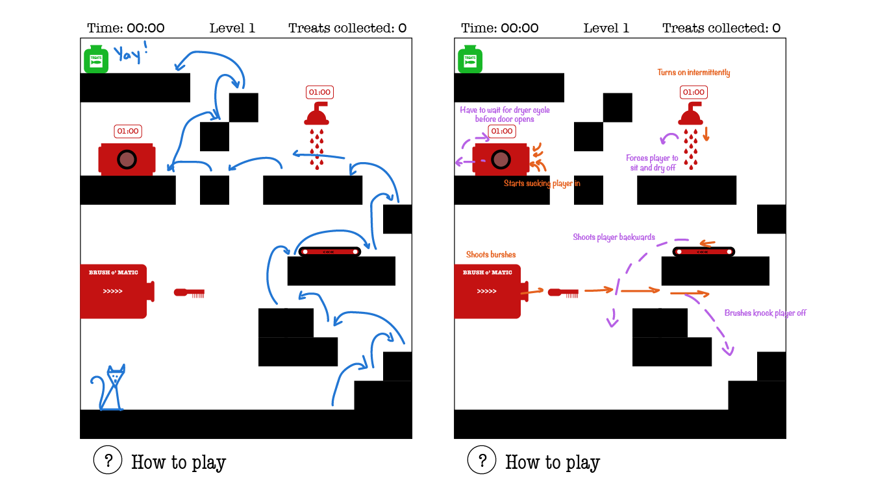

# Bodhi's Obstacle Course - Game Pitch

## What's the game about?

Bodhi loves his dental treats and wants to break open the jar to get them all! There's only one problem: his parents have set up a Rube Goldberg machine to groom and clean him. If he's going to make it to that jar he'll have jump over obstacles, dodge flying brushes, avoid the treadmill, sidestep the shower, and stay out of the dryer!

## Tech stack

- Vanilla HTML, JS, and CSS
- HTML5 Canvas

## Wireframes

## MVP Goals

- Create a movable player character
- Let character jump
- Create platforms to jump over / onto
- A goal that when reached ends the level
- Display a level timer -- The goal is to see how quickly you can complete the level
- A restart button

## Stretch Goals

- Add obstacles
  - A machine that shoots out brushes - Getting dazes the player for a few seconds
  - A treadmill moving in the opposite direction of desired travel
  - A shower that intermittently turns on. Getting wet slows the player down
  - A timed dryer. If the player gets sucked in, they'll have to wait for the dryer to finish its cycle before it opens up
- Animated sprites
- Have viewport move with character, so that the whole level isn't visible at once
- Double jumping / wall jumping for harder obstacles
- Extra treats to collect along the way
- Multiple levels

## Potential Roadblocks

- Implementing physics could be challenging and will require research
  - Acceleration
  - Gravity
  - Arc jumps
- Focusing on aesthetics rather than functionality - will need to be mindful of this throughout
